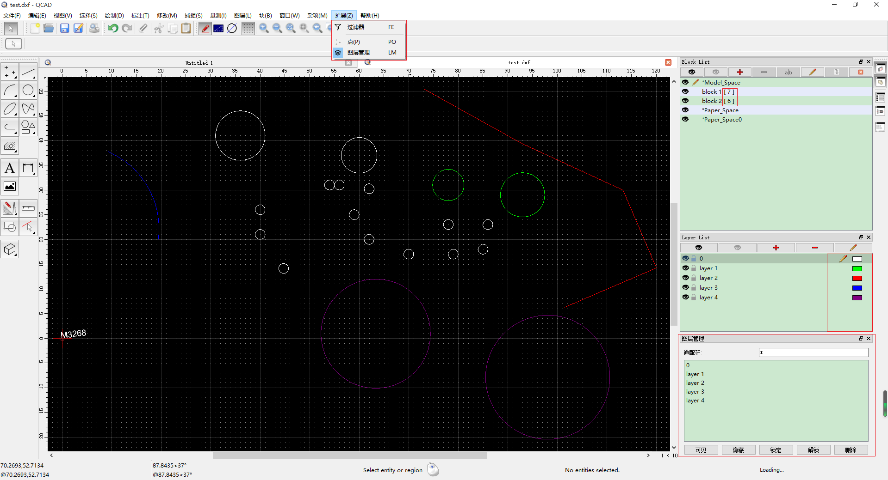
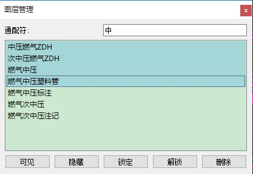

- [QCAD 扩展开发](#qcad-扩展开发)
  - [功能列表](#功能列表)
  - [图层管理器](#图层管理器)
    - [菜单[ `Extensions(扩展)`]->[`Layer Manager （图层管理器）`]](#菜单-extensions扩展-layer-manager-图层管理器)
    - [操作](#操作)
      - [过滤筛选](#过滤筛选)
        - [示例](#示例)
      - [列表多选](#列表多选)
      - [可见、隐藏、锁定、解锁和删除操作](#可见隐藏锁定解锁和删除操作)
  - [查询过滤器](#查询过滤器)
    - [菜单[ `Extensions(扩展)`]->[`Filter Editor（过滤器）`]](#菜单-extensions扩展-filter-editor过滤器)
    - [操作](#操作-1)
      - [选择类型](#选择类型)
      - [实体类型查询 [Entity type]](#实体类型查询-entity-type)
      - [实体属性值查询 [Property]](#实体属性值查询-property)
      - [实体属性值比较运算符 [Comparison]](#实体属性值比较运算符-comparison)
      - [示例](#示例-1)
  - [块属性列表](#块属性列表)
  - [图层显示列表](#图层显示列表)
  - [发布版本](#发布版本)
  
# QCAD 扩展开发 

## 功能列表

- 点 [示例]

- Widget
  - 图层管理器
  - 过滤器

- 修改
    - 块属性列表
    - 图层列表

- 插件国际化支持
  
- 引用实体的概略显示（只显示圆）
  
## 图层管理器

### 菜单[ `Extensions(扩展)`]->[`Layer Manager （图层管理器）`]

### 操作

#### 过滤筛选
在[`Filter Pattern`]中输入通配符，如 *、?、[0-9] 和[a-z] 。

- `*` 表示 0 或多个字符
- `?` 表示 任意 1 个字符
- [0-9] 表示0-9中的任意1个字符
- [a-z] 表示a-z中的任意1个字符

##### 示例

`燃气` 匹配名称中含有**燃气**的图层。

`中压?????` 匹配名称中含有**中压后跟5个字符**的图层。

#### 列表多选
选择图层项目，以便应用可见、隐藏、锁定、解锁和删除操作

#### 可见、隐藏、锁定、解锁和删除操作
- [`Show`] 使选择图层可见
- [`Hide`] 使选择图层隐藏
- [`Locked`] 使选择图层锁定
- [`UnLocked`] 使选择图层解锁
- [`Delete`] 删除选择图层

## 查询过滤器

### 菜单[ `Extensions(扩展)`]->[`Filter Editor（过滤器）`]

### 操作

#### 选择类型

- [New] 重新选择
- [Add] 增选
- [Subtract] 减选
- [Intersect] 两次选择取交集

#### 实体类型查询 [Entity type]

可以对 `Point`,`Line`,`PolyLine`,`块`等实体类型选择。

#### 实体属性值查询 [Property]

可以对 实体所在图层、显示颜色、块名及长度范围进行选择。

#### 实体属性值比较运算符 [Comparison]

支持 =，!=, >,<,包含(contains),字符开头(start with),字符结尾（end with)等操作。

#### 示例

选择显示颜色为白色的所有实体

选择块名为`RQJ`的块实体

选择多段线长度大于1000的实体

提示：选择多段线长度大于 1000 且小于 10000 
- 首先选择多段线大于1000的实体,进行[New]操作,
- 然后选择多段线小于10000的实体,进行[Intersect]相交操作。

## 块属性列表

显示引用块实体的数目

## 图层显示列表

添加图层条目编辑图标和显示图层颜色样式图标

## 发布版本

百度网盘提取码：kytq
[QCAD64Setup 3.25.0.0(git_bdbe759_wblong_20200918105706)](https://pan.baidu.com/s/1NwjZr_qbro3FyTQBHbux1w)