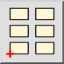

1. Selectați blocul pe care doriți să-l inserați din lista de blocuri.
2. Faceți clic pe butonul Inserare sau selectați „Inserare bloc" din meniu.
3. Introduceți unghiul de rotație și factorul de scară pentru referința
 blocului în bara de instrumente a opțiunilor.
4. Specificați poziția blocului inserat făcând clic pe o coordonată sau
 introducând o coordonată în consolă.
5. Pentru a crea o întreagă matrice de blocuri, faceți clic pe butonul matrice din bara de instrumente a opțiunilor:  
  
Introduceți coloanele, rândurile, spațierea coloanelor și spațierea rândurilor în dialogul afișat.
 Aceste proprietăți pot fi de asemenea editate ulterior folosind editorul de proprietăți.
