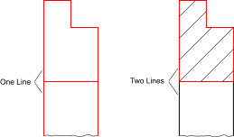
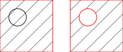

1. Bereid de objecten die het vulgebied omringen voor op een gesloten
 contour. De contour moet zo worden afgesloten dat de ene object met de andere
 is verbonden, zoals rechts in dit voorbeeld wordt getoond:  

2. Selecteer de te vullen contour(s). Let erop dat eilanden binnen contouren
 zijn uitgekomen als ze niet zijn geselecteerd:  

3. Start de arcering functie.
4. Er verschijnt een dialoogvenster voor de arcering opties. Kies een
 arcering patroon, schaalfactor en een rotatiehoek voor het patroon. Als u het
 object wilt vullen met een effen kleur in plaats van met een patroon,
 schakelt u het vakje 'Inkleuring' in.
5. Klik op 'OK' om verder te gaan. Afhankelijk van de complexiteit van de
 contour en de schaalfactor van het gekozen patroon kan het enige tijd duren
 tot het maken van het arcering.
