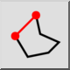

1. Kies de gewenste
[lijntype](../../doc/Line_nl.html#type) in de opties werkbalk.
2. Bepaal het beginpunt van het eerste lijnsegment. U kunt de muis gebruiken
of
een coördinaat in de console invoeren.
3. Bepaal het eindpunt van het eerste lijnsegment.
4. Bepaal de eindpunten van extra lijnsegmenten. Klik op de knop "Sluiten".
in de opties werkbalk om de sequentie te sluiten:

  
  
Als u een enkel lijnsegment ongedaan moet maken, kunt u dit doen door op
de knop "Ongedaan maken" te klikken:

  

5. Je kunt de lengte of hoek van de lijn op vaste waarden instellen met de juiste ingangen in de werkbalk Opties.
