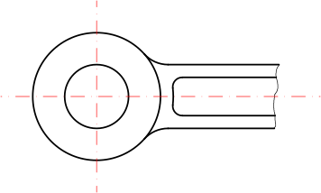

Konstruiert Freihand Linien. Dieses Werkzeug sollte sparsam eingesetzt
werden, da technische Zeichnungen in der Regel nahezu absolute Genauigkeit
erfordern. Unter gewissen Umständen kann es aber sinnvoll sein, eine Linie mit
der Maus frei zu zeichnen, z.B. für gebrochene Kanten wie hier gezeigt:  

