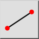
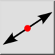
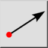

*Tipi di linea*

La maggior parte degli strumenti per le linee consente di scegliere il
 tipo di linea da creare nella barra degli strumenti delle opzioni . I tipi di
 linea disponibili sono

- Auto:  
  
Crea automaticamente una linea dello stesso tipo di un'altra linea
 scelta. Questo vale per l'utensile per linee parallele.
- Segmento di linea:  
  
Crea segmenti di linea da un punto iniziale a un punto finale.
- Linea Infinita:  
  
Crea infinite linee che attraversano due punti prestabiliti.
- Raggi:  
  
Crea raggi da un dato punto di partenza, attraverso un altro punto di
 lunghezza infinita.
