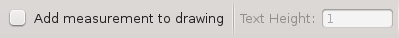
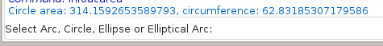
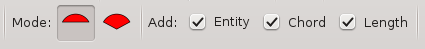
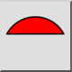
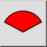
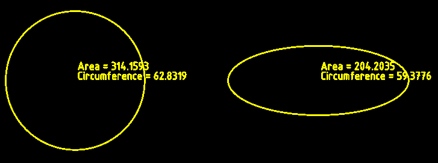
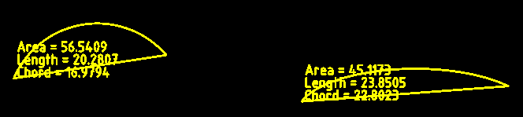
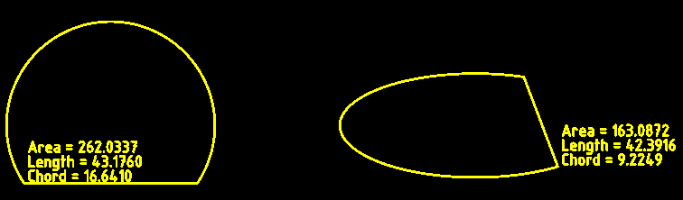
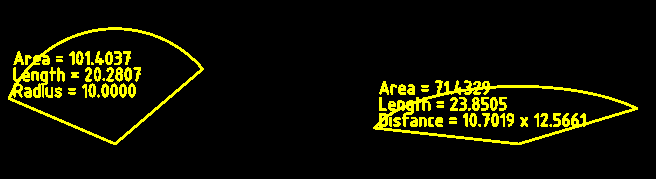
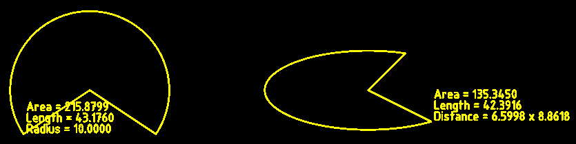

Autor: Robert S.

Este comando calcula el área de arcos, círculos, elipses y arcos elípticos,
y opcionalmente añade la información a la capa actual de un dibujo. Si
selecciona cualquier otro tipo de entidad, se muestra una advertencia en la
línea de comandos.

Para los arcos, hay dos opciones para calcular áreas: Segmento o Sector. El
área de un segmento (o rebanada) es el área delimitada por el arco y dos líneas
trazadas desde el punto inicial y el punto final del arco hasta el centro del
arco. El área de un sector es el área delimitada por el arco y una cuerda
dibujada desde el punto inicial del arco hasta el punto final.

  
Figura 1: un segmento (slice) y un sector.

**Opciones**

Este comando tiene las opciones estándar *"Añadir medida al dibujo*" y *"Altura del texto*".

  
Figura 2: Opciones de información estándar

Tanto si está desactivado como si no, al hacer clic en un arco, círculo,
elipse o arco elíptico, la información se muestra en el widget de la línea de
comandos.

  
Figura 3: Información mostrada en la línea de comandos

(Nota: Cada vez que inicie un comando de información, la casilla de
verificación *"Añadir medida al dibujo*" siempre estará desmarcada. No olvide
encenderlo si desea que la información se añada al dibujo).

También agrega las siguientes opciones.

  
Figura 4: Opciones añadidas

**Mode:**

El modo sólo se aplica a los arcos.

  
*Sector:* Este modo devuelve el área del sector. Esto es útil cuando se
usa junto con el comando *"Área poligonal*".

 *Segmento:* Este modo devuelve el área del segmento.

**Add:**

*Entidad:* Esto selecciona si desea añadir una copia de la entidad medida
a la capa actual del dibujo.

*Acorde:* Esto selecciona si desea que el acorde (sector), o las líneas de
radio (segmento), se agreguen al dibujo.

*Longitud:* Por defecto, el área siempre se imprime en el dibujo. Esta
opción selecciona si desea añadir información adicional al dibujo.

Para círculos y elipses completas, la información adicional es la
circunferencia. Esto usa el punto central como la esquina inferior izquierda
para el texto agregado.

Para arcos circulares la información extra es la longitud del arco y la
longitud de la cuerda (en modo sector), o el radio (en modo segmento).

En el caso de las elipses, la información adicional es la longitud del arco
y la longitud de la cuerda (en modo sector), o la distancia desde el punto
central hasta el punto inicial del arco, seguida de la distancia desde el punto
central hasta el punto final del arco (en modo segmento).

La esquina inferior izquierda del texto agregado es el punto final del
arco.

