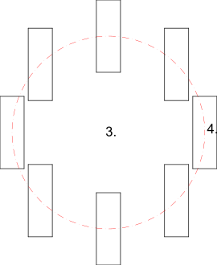

1. Seleccione las entidades que desea rotar y contra-rotar.
2. Inicie esta herramienta.
3. Establezca el centro de la rotación principal con el ratón o introduzca
 una coordenada en la línea de comandos.
4. Fije el centro de la rotación para los objetos individuales. Este
 segundo centro de rotación se rota junto con las entidades alrededor del
 primer centro.
5. Aparece el cuadro de diálogo Girar dos, en el que puede introducir el
 ángulo de rotación y el ángulo de contrarrotación.  
Para eliminar las entidades originales, marque la casilla "Eliminar
 original", para copiarlas También puede crear un número determinado de
 copias seleccionando "Múltiples copias".  
Las nuevas entidades se colocan en la misma capa que los originales y
 tienen los mismos atributos. Para utilizar la capa actual y los atributos
 actuales, en su lugar, marque "Usar capa y atributos actuales".
6. Haga clic en "OK" para rotar las entidades.

