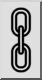

1. Välj de enheter som du vill skala.
2. Starta det här verktyget.
3. Ange centrum för skalningen med musen eller ange en koordinat på
 kommandoraden.
4. Dialogrutan för skalning visas där du kan ange skalningsfaktorn.  
Om du vill skala med två olika faktorer i X- och Y-riktningen
 avmarkerar du knappen för proportionell skalning:  
  
Du kan sedan ange två olika skalningsfaktorer för X och Y.  
Om du vill skala urvalet med hjälp av musen markerar du knappen för
 muspekaren:  

5. Klicka på "OK".
6. Om du tidigare har valt att skala urvalet med musen måste du nu ange en
 referenspunkt och en målpunkt för skalningen.
