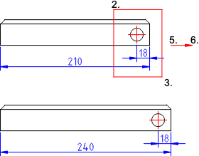

Dette værktøj strækker konturer og dimensioner. Dette kan også beskrives som
at flytte alle endepunkter inden for et givet rektangulært eller polygonalt
område.  
Hvis der er et udvalg af enheder, påvirker dette værktøj kun de udvalgte
enheder. Ellers virker dette værktøj på alle entiteter i det givne område  

