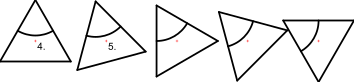

1. Select the entities you want to move or copy.
2. Launch this tool.
3. Enter the rotation angle in the options toolbar
4. Set the reference point with the mouse or enter a coordinate in the
 command line.
5. Set the target point.  
In the figure below, the two reference points are labeled. The
 rotation angle in the example is 15 degrees and the number of copies four.
 This results in a total rotation angle of 60 degrees.
6. The move and rotate dialog is displayed.  
To move the entities, choose "Delete Original", to copy them choose
 "Keep Original". You can also create any given number of copies at once by
 choosing "Multiple Copies" and entering the number of copies in the text
 line below.  
The new entities are placed on the same layer as the originals and
 have the same attributes. To use the current layer and current attributes
 instead, tick "Use current layer and attributes".
7. Click "OK" to move and rotate the entities.

