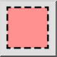
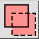
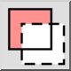
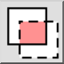

*Kruis selectie*

Sommige selectie functies kunnen worden gebruikt in de kruis
 selectiemodus. In deze modus worden niet alleen objecten geselecteerd die
 zich volledig binnen een bepaald gebied bevinden, maar ook objecten die zich
 slechts gedeeltelijk binnen het gebied bevinden. Deze selectie is ook bekend
 als "kruis selectie".

*Selectiemodus*

Met sommige selectie functies kunt u een selectiemodus kiezen in de opties
 werkbalk. De beschikbare selectiemodi zijn:

- Selectie vervangen:  
  
Vervangt de huidige selectie door de nieuwe selectie
 (standaard).
- Toevoegen aan de selectie:  
  
Voegt de selectie toe aan de huidige selectie.
- Verwijderen uit de selectie:  
  
Verwijdert de selectie uit de huidige selectie.
- Kruisen:  
  
Alleen objecten die al geselecteerd zijn en die voldoen aan de
 criteria van de selectie functie worden geselecteerd.
