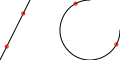

1. Introduza a distância na barra de ferramentas das opções.
2. Deslocar o cursor para a entidade ao longo da qual a distância deve ser
 medida.
3. Quando a posição desejada / visualização é mostrada, clique com o botão
 esquerdo do mouse para definir a coordenada.

