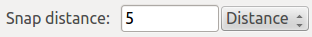
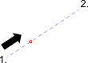

1. Nachdem dieses Werkzeug gestartet wurde können Sie
 in der Optionenwerkzeugleiste die gewünschte
 Art des Abstandes wählen ("Abstand", "Prozentsatz", "Bruchteil")
 und den Abstand eingeben.
2. Bestimmen Sie den ersten Punkt. Der Abstand wird von diesem
 Punkt aus gemessen.
3. Bestimmen Sie den zweiten Punkt.

