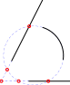

1. Når du har aktiveret dette snap-værktøj, skal du klikke på den første
 af de to skærende enheder.
2. Klik på den anden af de to skærende enheder. Hvis to skæringspunkter er
 mulige, skal du sørge for at klikke på den anden enhed et sted tættere på
 det skæringspunkt, som du vil fange til.

