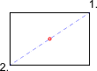

1. После активации этого инструмента привязки укажите первую из двух
 точек, определяющих среднюю точку. Например, один угол прямоугольника.
2. Щелкните вторую из двух точек, например, диагонально противоположный
 угол прямоугольника.

